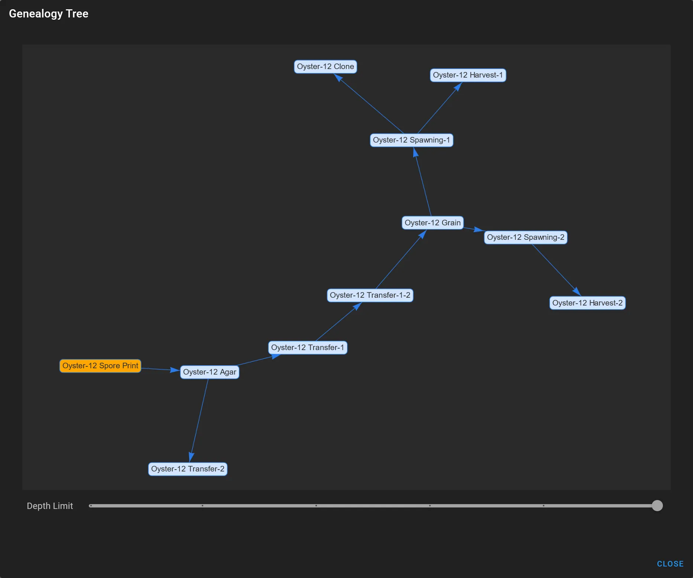

# Cultivare 🍄
Cultivare is a free, open-source cultivation and breeding software designed for mushroom enthusiasts, hobbyists, and mycologists.  It helps you organize and manage your mushroom strains, track their lineage, and optimize your cultivation process.

### Key Features:
- **Strain Management:** Catalog your collection of mushroom strains with detailed information.
- **Cultivation Tracking:** Record and analyze cultivation data.
- **Genealogy Tracking:** Build interactive genealogical trees of your mushroom strains to visualize their lineage and genetic relationships.
- **Barcode Functionality:** Generate and print barcode labels for your cultures and use a barcode scanner to quickly access strain information.
- **Open Source and Self-Hosted:** Maintain full control of your data with Cultivare's open-source codebase and self-hosting capabilities.
- **Docker Ready:** Easily deploy and manage Cultivare using Docker containers.

### Cultivare is perfect for:
- Hobbyist growers looking to organize their personal mushroom collection.
- Mycologists conducting research and breeding new strains.
- Community labs and educational institutions.

Join the [Cultivare community](https://www.patreon.com/cultivare) and contribute to the development of this powerful tool for mushroom cultivation.

### Current status: Closed beta
> Cultivare is currently under active development and buzzing with exciting new features! We're running a closed beta testing program within our community to gather feedback and refine the experience.  Want to be among the first to try it out? Join [our community](https://www.patreon.com/cultivare) and subscribe to this repository to stay updated on our progress.  Don't forget to give us a star ⭐ to show your support and be notified when the first stable version drops! We can't wait to share Cultivare with the world 🍄🍄🍄

___

### In addition to the features currently available, Cultivare is also under development for several new features, including:

- Statistics and Reporting: Gain insights into your cultivation performance with comprehensive statistics and customizable reports.
- Enhanced Global Search: Quickly find specific strains, notes, or tasks using a powerful global search function.
- Tag Management: Organize your strains and cultures with customizable tags and colors.
- Progressive Web App (PWA): Access Cultivare from anywhere on any device with a modern web browser.
- Todo List: Keep track of your tasks and cultivation activities with a built-in todo list.
- Share Link, Share Screenshot for Forums: Easily share your strains and cultures with others through links or screenshots.
- The Breeding API: Integrate Cultivare with the Breeding API to exchange strain data and collaborate with other researchers.
- DNA Analysis - FASTA Sequence Visualization and Comparison: Analyze and compare the DNA sequences of your strains with advanced visualization tools.

These features are still under development, but we are excited to bring them to you in the future. By continuing to develop Cultivare, we hope to create a powerful and comprehensive tool for mushroom cultivation and research.